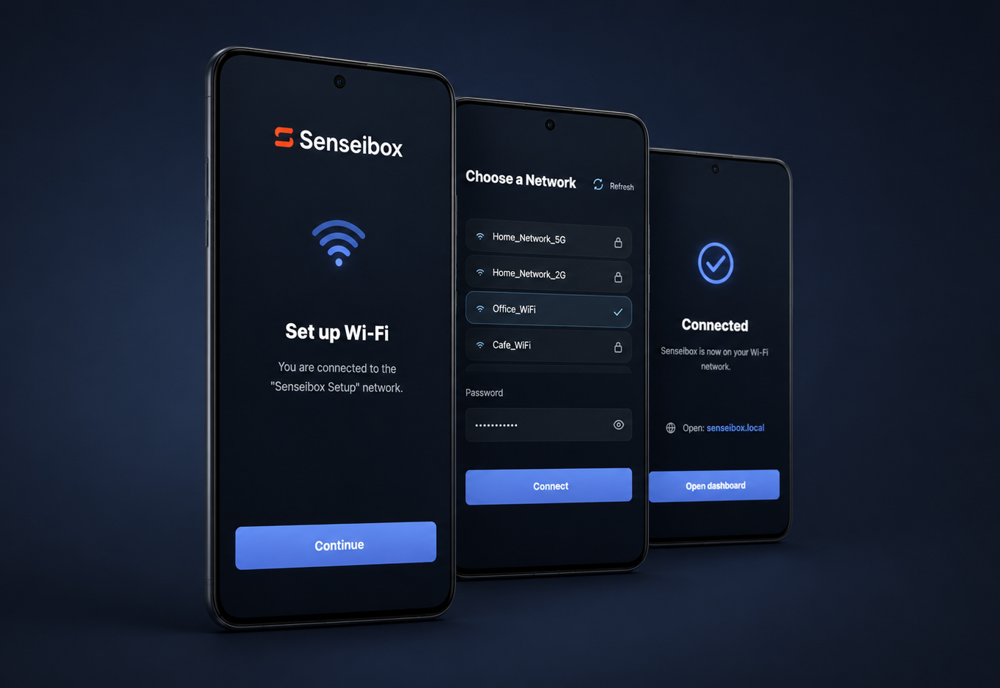

# Senseibox Wi-Fi AP Mode

Wi-Fi onboarding service for Senseibox. It starts a local setup page in access point mode, captures Wi-Fi credentials, and stores the network configuration for the device to use on reconnect.



## Install

```sh
sudo ./install.sh
```

The installer deploys the app to `/opt/senseibox/senseibox-wifi-ap-mode`, creates or reuses the shared no-login `senseibox:senseibox` service account, installs a virtualenv under `/opt/senseibox/senseibox-wifi-ap-mode/.venv`, and starts the `senseibox-wifi-ap-mode` systemd service.

It also installs the Debian runtime packages required for Wi-Fi setup and AP mode, including NetworkManager, `hostapd`, `dnsmasq`, Python venv support, `rsync`, and Wi-Fi/network utility packages.

AP setup mode reads deployment-specific settings from `/etc/senseibox/senseibox-wifi-ap-mode`. Before hardware AP testing, set the setup gateway and DHCP range there:

```sh
sudoedit /etc/senseibox/senseibox-wifi-ap-mode
```

The installer creates this file with the required variable names commented out so product-specific network values are not baked into the repository.

Setup AP mode shuts down automatically if setup is not completed. The default timeout is 10 minutes and can be changed in `/etc/senseibox/senseibox-wifi-ap-mode`:

```sh
SENSEIBOX_SETUP_TIMEOUT_SECONDS="600"
```

The setup page listens on port `8080`:

```text
http://<senseibox-host>:8080/
```

## Operations

Check service status:

```sh
sudo systemctl status senseibox-wifi-ap-mode.service
```

Follow service logs:

```sh
sudo journalctl -u senseibox-wifi-ap-mode.service -f
```

Check AP support services and wireless diagnostics:

```sh
sudo systemctl status hostapd
```

```sh
ip a
```

```sh
iw dev
```

```sh
iw list
```

## API

`GET /api/version` returns the running app version:

```json
{"version":"0.1.0"}
```

`POST /api/wifi` accepts Wi-Fi credentials:

```json
{"ssid":"Network name","password":"network password"}
```

By default, saved Wi-Fi settings are written to `/opt/senseibox/senseibox-wifi-ap-mode/state/network.json` with owner-only permissions. Set `SENSEIBOX_WIFI_CONFIG` to override that path.

## Service Modes

Systemd runs boot mode:

```sh
sudo systemctl start senseibox-wifi-ap-mode.service
```

Boot mode exits when wired or Wi-Fi networking is already healthy. If setup is needed, it starts AP mode and serves the setup page.

Manual recovery can force setup mode:

```sh
sudo /opt/senseibox/senseibox-wifi-ap-mode/.venv/bin/senseibox-wifi-ap-mode --host 0.0.0.0 --port 8080
```

For local development without AP control:

```sh
senseibox-wifi-ap-mode --web-only --host 127.0.0.1 --port 8080
```

For development on machines without NetworkManager Wi-Fi hardware, run with fake Wi-Fi scan and connect data. This keeps the web flow testable without starting AP mode or touching Linux networking services:

```sh
sudo /opt/senseibox/senseibox-wifi-ap-mode/.venv/bin/senseibox-wifi-ap-mode --host 0.0.0.0 --port 8080 --fake-network
```

In a local checkout, use the same flag with your editable install:

```sh
senseibox-wifi-ap-mode --host 127.0.0.1 --port 8080 --fake-network
```

Fake network mode stores submitted test credentials in `.dev-state/network.json` by default so local development does not require the production `/opt/senseibox/senseibox-wifi-ap-mode/state` directory. Set `SENSEIBOX_WIFI_CONFIG` to override that path.


## License

This software is licensed under the [GPL-3.0](LICENSE.md).
